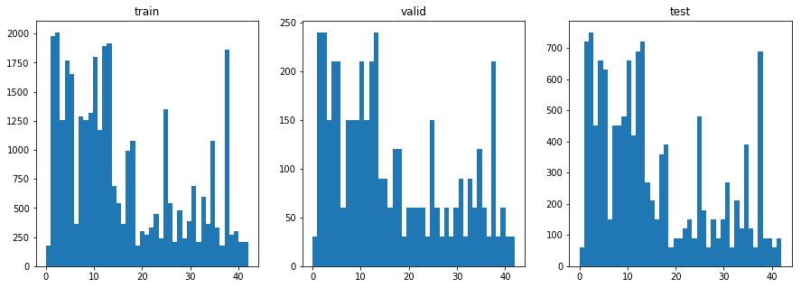
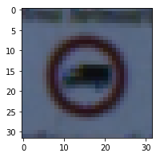
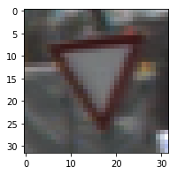
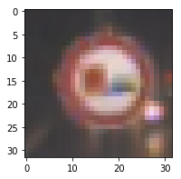
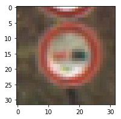
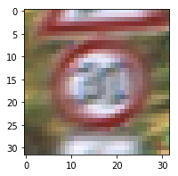
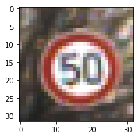

# **Traffic Sign Recognition** 

## Writeup

### You can use this file as a template for your writeup if you want to submit it as a markdown file, but feel free to use some other method and submit a pdf if you prefer.

---

**Build a Traffic Sign Recognition Project**

The goals / steps of this project are the following:
* Load the data set (see below for links to the project data set)
* Explore, summarize and visualize the data set
* Design, train and test a model architecture
* Use the model to make predictions on new images
* Analyze the softmax probabilities of the new images
* Summarize the results with a written report


[//]: # (Image References)

[image1]: ./examples/visualization.jpg "Visualization"
[image2]: ./examples/grayscale.jpg "Grayscaling"
[image3]: ./examples/random_noise.jpg "Random Noise"
[image4]: ./examples/placeholder.png "Traffic Sign 1"
[image5]: ./examples/placeholder.png "Traffic Sign 2"
[image6]: ./examples/placeholder.png "Traffic Sign 3"
[image7]: ./examples/placeholder.png "Traffic Sign 4"
[image8]: ./examples/placeholder.png "Traffic Sign 5"

## Rubric Points
### Here I will consider the [rubric points](https://review.udacity.com/#!/rubrics/481/view) individually and describe how I addressed each point in my implementation.  

---
### Writeup / README

#### 1. Provide a Writeup / README that includes all the rubric points and how you addressed each one. You can submit your writeup as markdown or pdf. You can use this template as a guide for writing the report. The submission includes the project code.

You're reading it! and here is a link to my [project code](https://github.com/udacity/CarND-Traffic-Sign-Classifier-Project/blob/master/Traffic_Sign_Classifier.ipynb)

### Data Set Summary & Exploration

#### 1. Provide a basic summary of the data set. In the code, the analysis should be done using python, numpy and/or pandas methods rather than hardcoding results manually.

I used the pandas library to calculate summary statistics of the traffic
signs data set:

* Number of training examples = 34799
* Number of testing examples = 12630
* Image data shape = (32, 32, 3)
* Number of classes = 43

#### 2. Include an exploratory visualization of the dataset.

Here is an exploratory visualization of the data set. It is a bar chart showing how the data distributed for training, validation and test set.



### Design and Test a Model Architecture

#### 1. Describe how you preprocessed the image data. What techniques were chosen and why did you choose these techniques? Consider including images showing the output of each preprocessing technique. Pre-processing refers to techniques such as converting to grayscale, normalization, etc. (OPTIONAL: As described in the "Stand Out Suggestions" part of the rubric, if you generated additional data for training, describe why you decided to generate additional data, how you generated the data, and provide example images of the additional data. Then describe the characteristics of the augmented training set like number of images in the set, number of images for each class, etc.)

As a first step, I decided NOT to convert the images to grayscale because I think the color data is very important for traffic sign recognition. For example the emergancy sign are red like stop sign, but those unemergancy sign are white or yellow.

Here is an example of a traffic sign image.



As a last step, I normalized the image data because it can balance the data and shink the data range to accomodate the network weights.


#### 2. Describe what your final model architecture looks like including model type, layers, layer sizes, connectivity, etc.) Consider including a diagram and/or table describing the final model.

My final model consisted of the following layers:

| Layer         		|     Description	        					| 
|:---------------------:|:---------------------------------------------:| 
| Input         		| 32x32x3 RGB image   							| 
| Convolution 3x3     	| 1x1 stride, same padding, outputs 32x32x6 	|
| RELU					|												|
| Max pooling	      	| 2x2 stride,  outputs 16x16x6					|
| Convolution 3x3	    | 1x1 stride, same padding, outputs 16x16x16  	|
| RELU					|												|
| Max pooling	      	| 2x2 stride,  outputs 16x16x16					|
| Flatten				| 												|
| Fully connected		| output 120									|
| Fully connected		| output 84										|
| Fully connected		| output 43										|
| Softmax				| 	        									|


#### 3. Describe how you trained your model. The discussion can include the type of optimizer, the batch size, number of epochs and any hyperparameters such as learning rate.

To train the model, I used an learning rate of 0.01, epochs is 10, batch size is 128.

#### 4. Describe the approach taken for finding a solution and getting the validation set accuracy to be at least 0.93. Include in the discussion the results on the training, validation and test sets and where in the code these were calculated. Your approach may have been an iterative process, in which case, outline the steps you took to get to the final solution and why you chose those steps. Perhaps your solution involved an already well known implementation or architecture. In this case, discuss why you think the architecture is suitable for the current problem.

My final model results were:
* validation set accuracy of 0.963


If a well known architecture was chosen:
* What architecture was chosen?
LeNet
* Why did you believe it would be relevant to the traffic sign application?
It works well in MINST, which is pretty similar to this project.
* How does the final model's accuracy on the training, validation and test set provide evidence that the model is working well?
0.963

### Test a Model on New Images

#### 1. Choose five German traffic signs found on the web and provide them in the report. For each image, discuss what quality or qualities might be difficult to classify.

Here are five German traffic signs that I found on the web:

   
 

The first image might be difficult to classify because ...

#### 2. Discuss the model's predictions on these new traffic signs and compare the results to predicting on the test set. At a minimum, discuss what the predictions were, the accuracy on these new predictions, and compare the accuracy to the accuracy on the test set (OPTIONAL: Discuss the results in more detail as described in the "Stand Out Suggestions" part of the rubric).

Here are the results of the prediction:

| Image			        |     Prediction	        					| 
|:---------------------:|:---------------------------------------------:| 
| Yield      		| Yield									| 
| No passing for vehicles over 3.5 metric tons  |Speed limit (80km/h)|
|                                    No passing  |          No passing|
|                          Speed limit (30km/h)  |Roundabout mandatory|
|                          Speed limit (50km/h)  |Speed limit (50km/h)|


The model was able to correctly guess 3 of the 5 traffic signs, which gives an accuracy of 60%. 

Analysis:
For test image #2, it is blur and difficult to tell the difference from other signs;
For test image #4, the sign has an angle and the word on it is blur, so it may generate extra difficulties for the neural net to detect. 

#### 3. Describe how certain the model is when predicting on each of the five new images by looking at the softmax probabilities for each prediction. Provide the top 5 softmax probabilities for each image along with the sign type of each probability. (OPTIONAL: as described in the "Stand Out Suggestions" part of the rubric, visualizations can also be provided such as bar charts)

The code for making predictions on my final model is located in the 11th cell of the Ipython notebook.

```
Test Image[0]
             Prediction  Probability
0                 Yield          1.0
1  Speed limit (20km/h)          0.0
2  Speed limit (30km/h)          0.0
3  Speed limit (50km/h)          0.0
4  Speed limit (60km/h)          0.0

Test Image[1]
             Prediction  Probability
0  Speed limit (80km/h)          1.0
1  Speed limit (20km/h)          0.0
2  Speed limit (30km/h)          0.0
3  Speed limit (50km/h)          0.0
4  Speed limit (60km/h)          0.0

Test Image[2]
                                 Prediction   Probability
0                                No passing  9.937559e-01
1                     Speed limit (120km/h)  5.934616e-03
2     Right-of-way at the next intersection  3.083385e-04
3  Vehicles over 3.5 metric tons prohibited  1.022899e-06
4                     Speed limit (100km/h)  2.490353e-11

Test Image[3]
                     Prediction   Probability
0          Roundabout mandatory  1.000000e+00
1           Go straight or left  1.481069e-17
2  Dangerous curve to the right  5.755340e-18
3                    No passing  9.253657e-20
4          Speed limit (30km/h)  7.007240e-25

Test Image[4]
             Prediction  Probability
0  Speed limit (50km/h)          1.0
1  Speed limit (20km/h)          0.0
2  Speed limit (30km/h)          0.0
3  Speed limit (60km/h)          0.0
4  Speed limit (70km/h)          0.0

```


### (Optional) Visualizing the Neural Network (See Step 4 of the Ipython notebook for more details)
#### 1. Discuss the visual output of your trained network's feature maps. What characteristics did the neural network use to make classifications?


